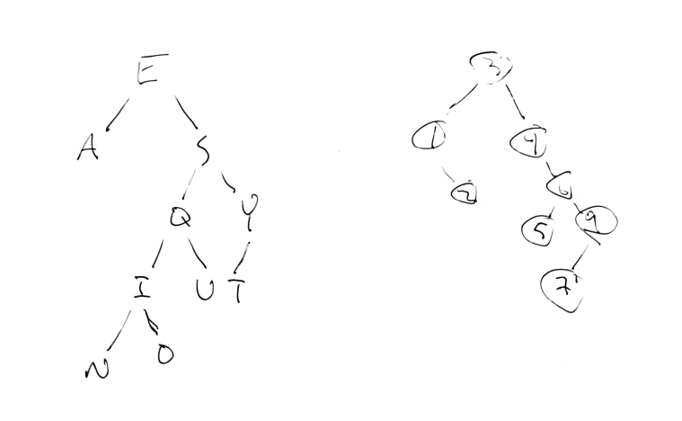
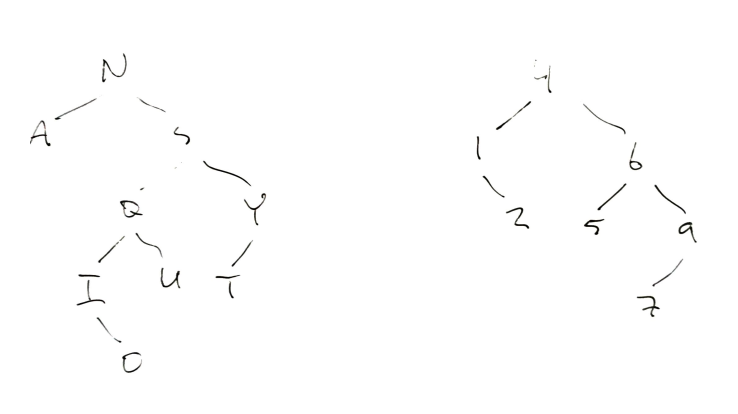

# Binary Search Trees

## 1. Draw a BST
- Given the data 3,1,4,6,9,2,5,7, if you were to insert this into an empty binary search tree, what would the tree look like? (Draw the tree, no coding needed here.)
- Draw the BST with the keys - E A S Y Q U E S T I O N



## 2. Remove the root

Show how the above trees would look like if you deleted the root of each tree. (Draw the trees, no coding needed here.)



## 3. Create a BST class
Walk through the binary search tree code in the curriculum and understand it well. Then write a BinarySearchTree class with its core functions (insert(), remove(), find()) from scratch.

- Create a binary search tree called BST and insert 3,1,4,6,9,2,5,7 into your tree. Compare your result with the result from the 1st exercise.
- Create a binary search tree called BST and insert E A S Y Q U E S T I O N into your tree. Compare your result with the result from the 1st exercise.

<details><summary><b>See Solution</b></summary>

```js
class BinarySearchTree {
  constructor(key=null, value=null, parent=null) {
    this.key = key;
    this.value = value;
    this.parent = parent;
    this.left = null;
    this.right = null;
  }

// Because each row in a balanced tree contains 2 times as many nodes as the row before, the width grows exponentially with the number of nodes. This means that conversely, the height must grow logarithmically with the number of nodes. So the average insert case is O(log(n))

  insert(key, value) {
    // console.log('insert is looking at key ' + this.key + '!')
    if (this.key === null) {
      this.key = key;
      this.value = value;
    }

    if (key < this.key) {
      if (this.left === null) {
        this.left = new BinarySearchTree(key, value, this);
      } else {
        return this.left.insert(key, value);
      }
    }

    else if (key > this.key) {
      if (this.right === null) {
        this.right = new BinarySearchTree(key, value, this);
      } else {
        return this.right.insert(key, value);
      }
    }
  }

  find(key) {
    console.log('find is looking at key ' + this.key + '!')
    if (this.key === key) {
      return this.value;
    }

    else if (key < this.key && this.left) {
      return this.left.find(key);
    }

    else if (key > this.key && this.right) {
      return this.right.find(key);
    }

    else {
      throw Error('Key error')
    }
  }

  remove(key, parent=null) {
    // console.log('remove is looking at key ' + this.key + '!')
    if (this.key === key) {

      // In case remove is called on the key of the root node
      if(parent === null) {
        throw Error('You cannot delete the root node of the tree')
      }

      if (this.key < parent.key) {

        // Node has no children
        if (!this.left && !this.right) {
          this._replaceWith(null);
        }

        // Node has one child
        else if (this.left && !this.right) {
          this._replaceWith(this.left);
        }
        else if (!this.left && this.right) {
          this._replaceWith(this.right);
        }

        // Node has two children
        else if (this.left && this.right) {
          // Find the minimum value in the right subtree
            // Make that node the new parent node
            // Remove that node, as it is now a duplicate

          const newParentNode = this.right._findMin();
          this.key = newParentNode.key;
          this.value = newParentNode.value;
          newParentNode.remove(newParentNode.key);
        }
      }
    }

    else if (key < this.key && this.left) {
      return this.left.remove(key, this);
    }

    else if (key > this.key && this.right) {
      return this.right.remove(key, this);
    }

    else {
      throw Error('Key error')
    }
  }

  _replaceWith(node){
    if (this.parent) {
      if (this == this.parent.left) {
        this.parent.left = node;
      }
      else if (this == this.parent.right) {
        this.parent.right = node;
      }

      if (node) {
        node.parent = this.parent;
      }
    }
    else {
      if (node) {
        this.key = node.key;
        this.value = node.value;
        this.left = node.left;
        this.right = node.right;
      }
      else {
        this.key = null;
        this.value = null;
        this.left = null;
        this.right = null;
      }
    }
  }

  _findMin() {
    if (!this.left) {
      return this;
    }
    return this.left._findMin();
  }

}

const BST = new BinarySearchTree;
BST.insert(3);
BST.insert(1);
BST.insert(4);
BST.insert(6);
BST.insert(9);
BST.insert(2);
BST.insert(5);
BST.insert(7);
console.log(BST)

const BST2 = new BinarySearchTree;
BST2.insert('E')
BST2.insert('A')
BST2.insert('S')
BST2.insert('Y')
BST2.insert('Q')
BST2.insert('U')
BST2.insert('E')
BST2.insert('S')
BST2.insert('T')
BST2.insert('I')
BST2.insert('O')
BST2.insert('N')
console.log(BST2)
```

</details>

## 4. What does this program do?
Without running this code in your code editor, explain what the following program does. Show with an example the result of executing this program. What is the runtime of this algorithm?

```js
function tree(t){
    if(!t){
        return 0;
    }
    return tree(t.left) + t.value + tree(t.right)
}
```

> This function recursively sums every element in a tree
> Runtime: O(n) as the function is called for every node in the tree

## 5. Height of a BST
Write an algorithm to find the height of a binary search tree. What is the time complexity of your algorithm?

```js
function findBstHeight(tree) {
  if (tree === null) {
    return -1;
  }

  let left = findBstHeight(tree.left);
  let right = findBstHeight(tree.right);

  if (left > right) {
    return left + 1;
  } else {
    return right + 1;
  }
}
```
> The function will inevitably be O(n) because we have to iterate down every branch to see if it chains further than every other branch

## 6. Is it a BST?
Write an algorithm to check whether an arbitrary binary tree is a binary search tree, assuming the tree does not contain duplicates.

```js
function isBst(tree) {
  if (tree === null) {
    return true;
  }

  if (tree.left && tree.left.key > tree.key) {
    return false;
  }
  if (tree.right && tree.right.key < tree.key) {
    return false;
  }

  let left = isBst(tree.left);
  let right = isBst(tree.right);

  return left && right;
}
isBst(BST)
```

## 7. 3rd largest node
Write an algorithm to find the 3rd largest node in a binary search tree.

```js
// First method: traverse the tree and generate an ordered array, then look up by index
function thirdLargestNode(tree) {
  let flatTree = displayBST(tree);
  let orderedTreeArray = flatTree.split('')

  return orderedTreeArray[orderedTreeArray.length - 3]
}
thirdLargestNode(BST)

// Another method would be to do reversed in-order tree traversal
```

## 8. Balanced BST
Write an algorithm that checks if a BST is balanced (i.e., a tree where no 2 leaves differ in distance from the root by more than 1).

```js
function isBalanced(tree) {
  if (tree === null) {
    return true;
  }

  if (
      tree.left 
      && (tree.left.left || tree.left.right) 
      && !tree.right
    ) {
    return false;
  }
  if (
      tree.right 
      && (tree.right.left || tree.right.right) 
      && !tree.left
    ) {
    return false;
  }

  let left = isBalanced(tree.left);
  let right = isBalanced(tree.right);

  return left && right;
}
isBalanced(BST)
```

## 9. Are they the same BSTs?
You are given two arrays which represent two sequences of keys that are used to create two binary search trees. Write a program that will tell whether the two BSTs will be identical or not without actually constructing the tree. You may use another data structure such as an array or a linked list but don't construct the BST. What is the time complexity of your algorithm? E.g., 3, 5, 4, 6, 1, 0, 2 and 3, 1, 5, 2, 4, 6, 0 are two sequences of arrays but will create the exact same BSTs and your program should return true.

```js
function sameBSTs(arr1, arr2) {
  // The first two items must be the same, 3 in the example case
  // If the next item in the array that is greater than 3 is not the same in each dataset
  // Or the next item in the array that is less than 3 is not the same in each dataset
  // Then the trees are not the same
  // Call the function again recursively for each subset of elements as the tree branches

  if (arr1[0] !== arr2[0]) {
    console.log('roots are not the same')
    return false;
  }
  if (arr1.length !== arr2.length) {
      console.log('trees are not the same size')
      return false;
  }

  const nextLeft1 = nextLowerIndex(arr1);
  const nextLeft2 = nextLowerIndex(arr2);
  if ((nextLeft1 && nextLeft2) && arr1[nextLeft1] !== arr2[nextLeft2]) {return false}

  const nextRight1 = nextHigherIndex(arr1);
  const nextRight2 = nextHigherIndex(arr2);
  if ((nextRight1 && nextRight2) && arr1[nextRight1] !== arr2[nextRight2]) {return false}

  let left = true;
  let right = true;

  if (nextLeft1 && nextLeft2) {
    left = sameBSTs(arr1.filter(i => i < arr2[0]), arr2.filter(i => i < arr2[0]));
  }
  if (nextRight1 && nextRight2) {
    right = sameBSTs(arr1.filter(i => i > arr1[0]), arr2.filter(i => i > arr2[0]));
  }

  return true && left && right;
}

function nextLowerIndex(arr) {
  for (let i = 0; i < arr.length; i++) {
    if (arr[i] < arr[0]) {
      return i;
    }
  }
  return null;
}
function nextHigherIndex(arr) {
  for (let i = 0; i < arr.length; i++) {
    if (arr[i] > arr[0]) {
      return i;
    }
  }
  return null;
}
sameBSTs(
[3, 5, 4, 6, 1, 0, 2],
[3, 1, 5, 2, 4, 6, 0]
);
// true
```