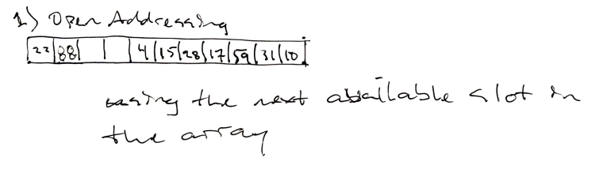
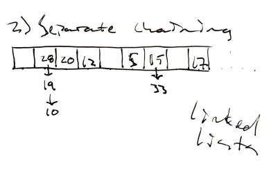

# Hashmaps

## 1. Create a HashMap class
Walk through the HashMap implementation in the curriculum and understand it well. Then write a HashMap class and its core functions with open addressing as the collision resolution mechanism.

Export your HashMap module
Create a .js file called HashMaps_drills. In the file import the HashMap module. Create a function called `main()`
Inside your `main()` function, create a hash map called `lotr`.
For your hash map that you have created, set the `MAX_LOAD_RATIO = 0.5` and `SIZE_RATIO = 3`.
Add the following items to your hash map: 
```{"Hobbit": "Bilbo"}, {"Hobbit": "Frodo"},
{"Wizard": "Gandalf"}, {"Human": "Aragorn"}, {"Elf": "Legolas"}, {"Maiar": "The Necromancer"},
{"Maiar": "Sauron"}, {"RingBearer": "Gollum"}, {"LadyOfLight": "Galadriel"}, {"HalfElven": "Arwen"},
{"Ent": "Treebeard"}
```
Print your hash map and notice the length and items that are hashed in your hash map. Have you hashed all the items you were asked to?
Retrieve the value that is hashed in the key `"Maiar"` and `Hobbit`.
What are the values of Maiar and Hobbit that you have? Is there a discrepancy? Explain your answer.
What is the capacity of your hash table after you have hashed all the above items? Explain your answer.

[Hashmap Implementation](./hashmap.js)

```js
const HashMap = require('./hashmap.js');
const deepEqual = require('deep-equal');

function main() {
  const lotr =  new HashMap;

  lotr.MAX_LOAD_RATIO = 0.5;
  lotr.SIZE_RATIO = 3;

  lotr.set('Hobbit', 'Bilbo');
  lotr.set('Hobbit', 'Frodo');
  lotr.set('Wizard', 'Gandalf');
  lotr.set('Human', 'Aragorn');
  lotr.set('Elf', 'Legolas');
  lotr.set('Maiar', 'The Necromancer');
  lotr.set('Maiar', 'Sauron');
  lotr.set('RingBearer', 'Gollum');
  lotr.set('LadyOfLight', 'Galadriel');
  lotr.set('HalfElven', 'Arwen');
  lotr.set('Ent', 'Treebeard');
  lotr.set('Ent1', 'Treebeard');
  lotr.set('Ent2', 'Treebeard');
  lotr.set('Ent3', 'Treebeard');

  lotr.get('Hobbit')
  lotr.get('Maiar')

  console.log(lotr);
}

HashMap {
  length: 12,
  _hashTable:
   [ { key: 'Ent2', value: 'Treebeard', DELETED: false },
     { key: 'Ent3', value: 'Treebeard', DELETED: false },
     { key: 'HalfElven', value: 'Arwen', DELETED: false },
     <1 empty item>,
     { key: 'LadyOfLight', value: 'Galadriel', DELETED: false },
     <1 empty item>,
     { key: 'Wizard', value: 'Gandalf', DELETED: false },
     { key: 'RingBearer', value: 'Gollum', DELETED: false },
     <4 empty items>,
     { key: 'Elf', value: 'Legolas', DELETED: false },
     { key: 'Hobbit', value: 'Frodo', DELETED: false },
     <6 empty items>,
     { key: 'Ent', value: 'Treebeard', DELETED: false },
     { key: 'Ent1', value: 'Treebeard', DELETED: false },
     { key: 'Human', value: 'Aragorn', DELETED: false },
     { key: 'Maiar', value: 'Sauron', DELETED: false } ],
  _capacity: 24,
  _deleted: 0,
  MAX_LOAD_RATIO: 0.5,
  SIZE_RATIO: 3 }
```

## 2. WhatDoesThisDo
DO NOT run the following code before solving the problem.

What is the output of the following code? explain your answer.

```js
const WhatDoesThisDo = function(){
    let str1 = 'Hello World.';
    let str2 = 'Hello World.';
    let map1 = new HashMap();
    map1.set(str1,10);
    map1.set(str2,20);
    let map2 = new HashMap();
    let str3 = str1;
    let str4 = str2;
    map2.set(str3,20);
    map2.set(str4,10);

    console.log(map1.get(str1));
    console.log(map2.get(str3));
}
```
>Initializes two HashMaps and sets key/values on them.
    It uses the same string as the key when setting key/values, which results in the hashmap replacing the value stored with that key.
    In other words, it sets a value at a specific index in the hashmap and then overwrites it.

## 3. Demonstrate understanding of Hash maps
*You don't need to write code for the following two drills. use any drawing app or simple pen and paper *

1) Show your hash map after the insertion of keys 10, 22, 31, 4, 15, 28, 17, 88, 59 into a hash map of length 11 using open addressing and a hash function k mod m, where k is the key and m is the length.



2) Show your hash map after the insertion of the keys 5, 28, 19, 15, 20, 33, 12, 17, 10 into the hash map with collisions resolved by separate chaining. Let the hash table have a length m = 9, and let the hash function be k mod m.



## 4. Remove duplicates
Implement a function to delete all duplicated characters in a string and keep only the first occurrence of each character. For example, if the input is string “google”, the result after deletion is “gole”. Test your program with a sentence as well such as "google all that you think can think of".
```js
function removeDuplicates(string) {
  const lib = new HashMap;

  let result = '';

  for (let char of string) {
    if (!lib.get(char)) { // If the char is not in the library, add the char to our result and then add it to the library
      result += char;
      lib.set(char, true);
    }
  }

  return result;
}
```

## 5. Any permutation a palindrome
Write an algorithm to check whether any permutation of a string is a palindrome. Given the string "acecarr", the algorithm should return true, because the letters in "acecarr" can be rearranged to "racecar", which is a palindrome. In contrast, given the word "north", the algorithm should return false, because there's no way to rearrange those letters to be a palindrome.
```js
function isPermutablePalindrome(string) {
  // In order to be a palindrome, no more than one char in a string can add up to an odd number.

  const charMap = new HashMap;

  // Loop through the chars in the string and add them to the charMap library
  for (let char of string) {
    let currentCount = charMap.get(char) || 0;
    charMap.set(char, currentCount + 1)
  }

  let odds = 0;

  // Count the number of odds in our charMap library
  const charMapKeys = charMap.keys()
  charMapKeys.forEach(key => {
    if (charMap.get(key) % 2 !== 0) {
      odds++
    }
  })

  // If the number of odds is one or less, then the string can be permuted into a palindrome
  if (odds <= 1) {
    return true;
  }

  return false;
}
// isPermutablePalindrome('amanaplanacanalpanama')
```

## 6. Anagram grouping
Write an algorithm to group a list of words into anagrams. For example, if the input was `['east', 'cars', 'acre', 'arcs', 'teas', 'eats', 'race']`, the output should be: `[['east', 'teas', 'eats'], ['cars', 'arcs'], ['acre', 'race']]`.

```js
// I think I would refactor this by sorting the strings alphabetically and comparing them that way rather than using deep-equal.

function groupAnagrams(arr) {
  // To avoid looping too much we'll use hash maps to compare each element in the array against.

  const resultArray = [];
  const charMapArray = []; // For storing hash maps of char counts

  arr.forEach((string, idx) => {
    let charMap = {};
    // Map the chars in the current word
    for (let char of string) {
      charMap[char] = charMap[char] + 1 || 1;
    }
    
    let wasPushed = false;
    // Loop over each of the character maps that we've seen so far and check if they are a match
    charMapArray.forEach((map, idx) => {
      if (deepEqual(map, charMap)) {
        resultArray[idx].push(string)
        wasPushed = true;
      }
      
    })

    // If the charMap wasn't pushed before, push it now along with a new array for the string.
    if (!wasPushed) {
      charMapArray.push(charMap)
      resultArray.push([string])
    }

    console.log(charMap)
  })
  console.log(resultArray)
}
groupAnagrams(['east', 'cars', 'acre', 'arcs', 'teas', 'eats', 'race'])
```

## 7. Separate Chaining
Write another hash map implementation as above, but use separate chaining as the collision resolution mechanism.

[Hash Map with Chaining Implementation](./hashmap-with-chaining.js)

Test your hash map with the same values from the lotr hash map.

```js
HashMap {
  length: 11,
  _hashTable:
   [ <2 empty items>,
     { key: 'HalfElven', value: 'Arwen', next: null, DELETED: false },
     <1 empty item>,
     { key: 'LadyOfLight',
       value: 'Galadriel',
       next: null,
       DELETED: false },
     <1 empty item>,
     { key: 'Wizard',
       value: 'Gandalf',
       next: [Object],
       DELETED: false },
     <5 empty items>,
     { key: 'Elf', value: 'Legolas', next: null, DELETED: false },
     { key: 'Hobbit', value: 'Frodo', next: null, DELETED: false },
     <6 empty items>,
     { key: 'Ent', value: 'Treebeard', next: null, DELETED: false },
     { key: 'Ent1', value: 'Treebeard', next: null, DELETED: false },
     { key: 'Ent2', value: 'Treebeard', next: null, DELETED: false },
     { key: 'Maiar', value: 'Sauron', next: [Object], DELETED: false } ],
  _capacity: 24,
  _deleted: 0,
  MAX_LOAD_RATIO: 0.5,
  SIZE_RATIO: 3 }
```